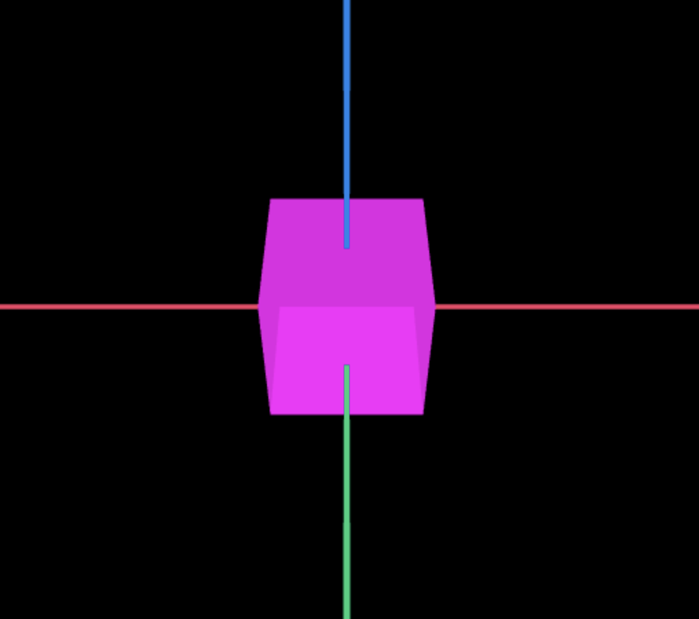

# @foxglove/regl-worldview

**Worldview** is a React library for rendering 2D and 3D scenes using [regl](https://github.com/regl-project/regl).

Visit the [homepage](https://cruise-automation.github.io/webviz/worldview) to see more guides, examples and APIs.

## Quick start

Add `@foxglove/regl-worldview` to your React project:

```bash
npm install --save @foxglove/regl-worldview
```

Then try rendering the [basic example](https://cruise-automation.github.io/webviz/worldview/#/docs/examples/basicexample):



```js
import React from "react";

import Worldview, { Cubes, Axes } from "@foxglove/regl-worldview";

function BasicExample() {
  const markers = [
    {
      pose: {
        orientation: { x: 0, y: 0, z: 0, w: 1 },
        position: { x: 0, y: 0, z: 0 },
      },
      scale: { x: 15, y: 15, z: 15 },
      color: { r: 1, g: 0, b: 1, a: 0.9 },
    },
  ];

  return (
    <Worldview>
      <Cubes>{markers}</Cubes>
      <Axes />
    </Worldview>
  );
}
```
